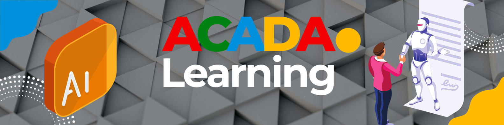
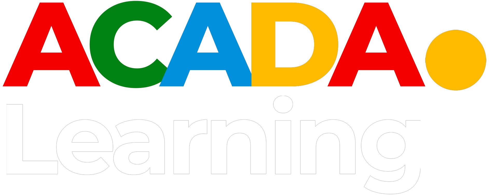

### :phone: +1 587 574 2233 || +1 587 429 3884
### **<span style="color:green"> website : <http://acadalearning.com/></span>**
### **:email: info@acadalearning.com**

# DevOps Engineering Master Program Cohort 10
:point_right: Registration Link: [Click here](https://forms.gle/rKkmKWyYssRLKDD3A)

:point_right: WhatsApp: [Click here](https://chat.whatsapp.com/IJB773jS2fTIZXCFwM9s58)
##### Note: Register with your fullname

# Register now and get one month FREE DevOps Hands-on training

## Class Starts January 15, 2023 - June 31, 2023
### $$\textcolor{steelblue}{\text{Class Days}}$$
```
  * Thursday 7:00PM MST
  * Sunday 12:00PM MST
```
### $$\textcolor{steelblue}{\text{Course Duration}}$$
```
  * 6 months + bootcamp
```
### ACADA's DevOps training program will provide you with in-depth knowledge of various DevOps tools, including:
```
  * Git
  * GitHub
  * Jenkins
  * Docker
  * Ansible
  * Terraform
  * Kubernetes
  * Helm
  * Prometheus and Grafana
  * Linux
  * SonarQube
  * Nexus
  * Dynatrace
  * Maven
  * Tomcat
  * AWS
  * Wildfly - JBoss
  * Shell Scripting
  * Python Scripting
  * SDLC
```
### After this program you can work as:
```
  * DevOps Engineer
  * DevOps Engineer Manager
  * Build and Release Engineer
  * Cloud Engineer
  * System Engineer
  * Site Reliability Engineer
  * Platform Engineer
  * Cloud Engineer
  * Infrastructure Engineer
  * IT Recruiter
  * Kubernetes Engineer
  * DevSecOps Engineer
  * IT Project Manager
```
### $$\textcolor{steelblue}{\text{Fees}}$$
```
  * $3,000 
  * Installmental payment avaliable
  * Other payment options still avaliable *(Speak to a constultant)*
```
### $$\textcolor{steelblue}{\text{Payment Details}}$$
```
  * Interact and paypal: payment@acadalearning.com
    Note: make payment with your fullname and cohort 10 as reference
```
### $$\textcolor{steelblue}{\text{Bootcamp}}$$
```
  * Resume preperation
  * LinkedIn setup
  * Interview preperation (Questions and answers)
```

